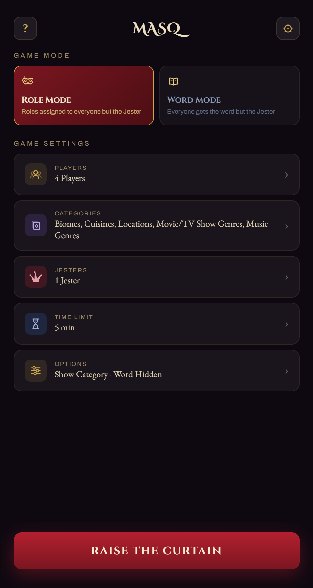

# Masq



Masq is a pass-and-play social deduction party game for one phone and a group of friends. Everyone but the Jester gets the secret word (and a role to match); the Jester has to bluff their way through questioning without getting caught.

**Play it live:**
- [masq.games](https://masq.games/)

## Playing

Open `index.html` in a browser (or use the live link above) — no install or build step. Add your players, pick a game mode and categories, then pass the phone around.

The lobby is saved in `localStorage`, so the table you set up is still standing next time you open the game on that device: the player list, the game mode, the categories, the jester count and how jesters are drawn, the time limit, the options, and light or dark. So are your custom categories and any words you've crossed out in Settings → View All Words. What doesn't carry over is the round itself, and the progressive jester's running odds — those start over on every reload.

**Game modes**

- **Role Mode** — every performer gets a role tied to the secret word; the Jester flies blind.
- **Word Mode** — everyone sees the same secret word except the Jester.

**Categories**

- Either mode: Biomes, Cuisines, Locations, Movie/TV Show Genres, Music Genres
- Word Mode only: Animals, Food/Drinks, Movies/TV, Objects
- Your own, via Settings → Custom Categories — saved in `localStorage`, so they stay on that device

**A round**

1. Whoever opens asks a question to another player.
2. That player answers, then asks the next — clues that fit your role without giving it away.
3. Once everyone's had a turn (or the timer runs out), the group votes.
4. The Jester is unmasked, along with the role every other player was holding. Guess right and the Cast wins; guess wrong and the Jester escapes.

**Options**

- Number of Jesters, fixed or randomized
- Truly Random or Progressive selection (nudges the role away from whoever just had it)
- Show/hide the category and word
- Jesters know each other
- A fake role/word for the Jester
- A round timer with an audio cue

Options that conflict with each other are dimmed rather than hidden.

## Tech

Plain React 18 + ReactDOM, loaded via CDN `<script>` tags — no bundler, package manager, or build step required.

```
src/
├── artwork/           the five generated artwork maps
│   ├── albums.js      album art map, exposed on window.MASQ_ALBUMS
│   ├── animals.js     animal photo map and photo credits, on
│   │                  window.MASQ_ANIMALS and window.MASQ_ANIMAL_CREDITS
│   ├── food.js        food photo map and photo credits, on
│   │                  window.MASQ_FOOD and window.MASQ_FOOD_CREDITS
│   ├── objects.js     object photo map and photo credits, on
│   │                  window.MASQ_OBJECTS and window.MASQ_OBJECT_CREDITS
│   └── posters.js     poster map, exposed on window.MASQ_POSTERS
├── app.js             all game state, logic, and rendering
├── data_roles.js      role catalogs, on window.MASQ_LOCATIONS_DATA
└── data_words.js      Word Mode's word lists and jester hints, on
                       window.MASQ_WORDS
tools/
├── fetch-albums.js    Node script, regenerates src/artwork/albums.js from Deezer
├── fetch-animals.js   Node script, regenerates src/artwork/animals.js from Wikipedia
├── fetch-cuisines.js  Node script, regenerates src/artwork/food.js from Wikipedia
├── fetch-objects.js   Node script, regenerates src/artwork/objects.js from Wikipedia
└── fetch-posters.js   Node script, regenerates src/artwork/posters.js from TMDB
CHANGELOG.md           what changed in each version
CNAME                  the custom domain, read by GitHub Pages on deploy
favicon.svg            tab icon (the comedy mask)
index.html             page shell, fonts, meta, and the CSS for Jester Mode
LICENSE
masq.png               screenshot, used by this README and as the link-preview image
README.md
robots.txt             crawl permission, and where the sitemap is
sitemap.xml            the one page, for Search Console
```

`index.html` stays at the repo root because GitHub Pages serves the repository root as a static site — moving it would take the live site down. It loads `src/data_roles.js` and `src/data_words.js`, then `src/artwork/posters.js`, `src/artwork/albums.js`, `src/artwork/animals.js`, `src/artwork/food.js` and `src/artwork/objects.js`, then `src/app.js`.

The markup inside `<div id="root">` is not dead code. `createRoot().render()` clears that container, so the moment React mounts it is gone and no player ever sees it — it is there for the crawlers that don't run JavaScript, which would otherwise find a page with a title and no content at all, since the whole game is drawn by script. Deleting it takes the site's indexable text back to nothing. The `.noscript-copy` rule above it exists for the same reason: on a slow connection that copy paints for a moment before the scripts land, and unstyled it would be black text on a near-black page.

The five artwork maps are generated and committed, so a round never waits on someone else's API. Re-run the matching script after changing a catalog in `src/data_roles.js` or a word list in `src/data_words.js`; each prints the entries it wasn't sure about, and each keeps a table of hand-pinned answers for the ones a plain search gets wrong. `fetch-animals.js`, `fetch-cuisines.js` and `fetch-objects.js` also collect the photo credits shown in-game, and refuse to write anything if they find a photo that needs crediting and no name to credit. `fetch-cuisines.js` additionally refuses when two *roles* resolve to the same photograph, which would show two players the same card in one round.

Three of those maps serve both modes at once: an animal is a Biomes role and an Animals word, a food is a Cuisines role and a Food/Drinks word, and the picture is the same either way, so each map is the union of the two lists. Objects are Word Mode only.

## Credits

Created by Arnav Podichetty and Richard Chen, with contributions by Esha Bansiya. Inspired by Spyfall and Imposter.

Movie and TV posters come from [TMDB](https://www.themoviedb.org/). This product uses the TMDB API but is not endorsed or certified by TMDB. Album art comes from [Deezer](https://www.deezer.com/), which likewise does not endorse or certify it.

Animal, food and object photographs are the lead images of [Wikipedia](https://en.wikipedia.org/) articles, hosted by [Wikimedia Commons](https://commons.wikimedia.org/). Each is under its own free licence — mostly Creative Commons, the rest public domain, and one under the Korean government's KOGL Type 1 — and most of those licences ask that the photographer be credited by name. So every one of them is named in the game itself, under **Settings → Credits**, and in `src/artwork/animals.js`, `src/artwork/food.js` and `src/artwork/objects.js` next to the photo they took.

## License

All Rights Reserved — see [LICENSE](LICENSE). Feel free to play the game via the live link above; the source code is not licensed for reuse or redistribution.

That covers this repository's own code and word lists. It doesn't cover the artwork, which belongs to the people credited above and stays under the licences they chose. Those licences don't reach back the other way either: the photographs are shown unaltered and merely sit alongside the game rather than being built into it, so the ShareAlike terms on many of them place no condition on the code here.
